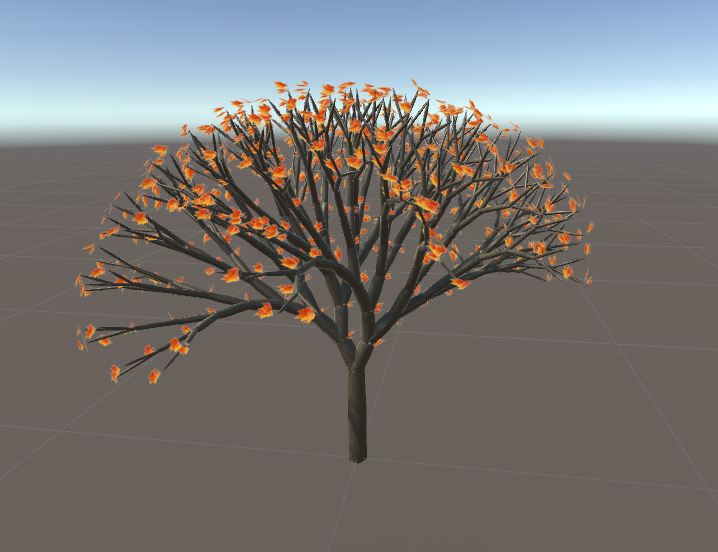
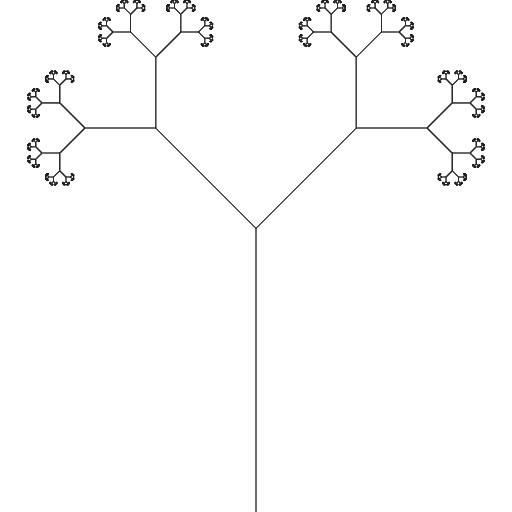
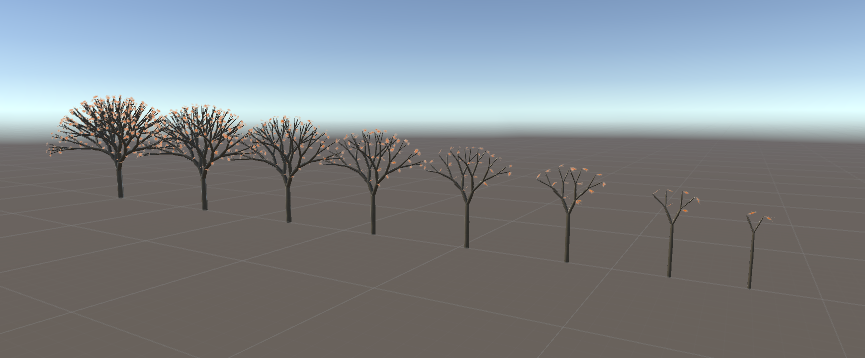
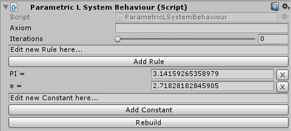
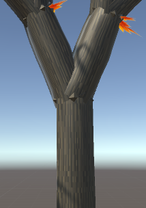
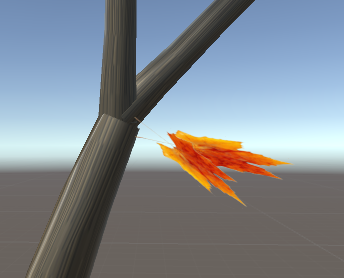
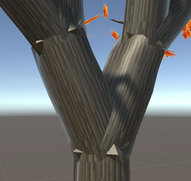

# Project


This was a project of the PGVW lecture (procedual generation virtual worlds).
The goal of this project was to create a tool for procedual generation virtual worlds
in a limited time of 2 days. The focus of this project was to create a Parametric L-System for trees.
Since the end of this project there was no changes. So was is my current goal to bring this project back to
a state which can hold my current standards.

# L-Systems
A l-system (Lindenmayer-System) allows creating realistic growing objects like plants.
Such systems uses a specific grammatic and a turtle-renderer to create
a sequence which can be used for a turtle-renderer to render objects.

## L-System-grammatic
A typical l-system-grammatic consists of the following:
- Axiom: The start/initial state as a string
- Alphabet: A set of symbols containing constants and terminals
- Production-rules: A set of rules to translate from one sequence into another sequence

As an example we have a Axiom "A", a Alphabet "(A,B,C)" and following rule-set:
- A -> ABA
- B -> CAC

The first iteration would be "ABA" and the second would be "ABACACABA".
It is now possible to do this a unlimited amount of iterations which would result into a really long sequence.

## L-System-turtle
After the generation of our sequence the turtle-renderer can use it to create an object.
The turtle does for each symbol in the alphabet an action.
For example "R -> Rotate 45° to the right" or "D -> Draw a line".\
Now with a sequence like "DRDRDRDRDR" a turtle would draw a circle step by step.

## Fractal tree


One of the more known L-Systems are the fractal tree which uses a FIFO-stack for its current rotation & position.\
It uses the following grammatic:
- Axiom: L
- Alphabet: T, L, \[, \], +, -
- Rules:
 - L -> T\[+L]-L
 - T -> TT

And uses the following actions by the turtle:
- L: draw a line
- T: draw a line
- \[: Push a new state into the stack
- \]: Pop a state from the stack
- +: Rotate 45°
- -: Rotate -45°

# Parametric L-System


A parametric L-Systems is an L-System which basically allows symbols to have a numeric property.
For example the "rotate 90°/45°/30°" can be simply "rotate x°". Also it now allows use to
easily add objects to a grown object.
For example "T(10)=T(11)[R(45°)T(1)][R(-45°)T(1)]" which means basically "split end of 10meter tree into 2 twigs".

# How to Use


**This projects only runs on Unity 2017**

By using this project you can add the new Gameobject in the Gameobject-Menu->ParametricLSystem->Tree.
If you want to make own Tree just change the rules, constants & axiom as you see fit and then click rebuild.
You can change following:
- Axiom
- Rules
- Iteration
- Constants

## Create own Rules & Constants
If you want to create a own rule just enter your rule in the rule-field like "F(x,y,z)=F(x+1,y-1,z*2)".
Creating constants is pretty much the same like "PI=3.14" to create PI.

## Alphabet
The basic alphabet is the following:
- X(x) : Rotate x-axis by x degree
- Y(y) : Rotate y-axis by y degree
- Z(z) : Rotate z-axis by z degree
- \[ : Push current transform-state
- \] : Pop current transform-state

## Object Alphabet
Also there is already an implemented alphabet for parts of a tree.

### Tree trunk


By writing D you create a tree trunk which has following parameters:
1. Bottom thickness
2. Top thickness
3. Length
4. X-Segment-Count
5. Y-Segment-Count
6. Perlin Noise Zoom
7. Perlin Noise Strength
### Leaf


With L you can create leaves with following parameters:
1. Leaf min count
2. Leaf max count
3. Leaf min length
4. Leaf max length
5. Leaf min width
6. Leaf max width
7. Leaf min X-Rotation
8. Leaf max X-Rotation
9. Leaf min Z-Rotation
10. Leaf max Z-Rotation
### Tree joint


To fill the gaps between tree trunks use J with these parameters:
1. Thickness
2. X-Segment-Count
3. Y-Segment-Count

## Tree Example
This is the actually code for the tree on the pictures above
which can also be found in the [ParametricLSystemEditor.cs](Assets/Scripts/PlantGenerator/Editor/ParametricLSystemEditor.cs).
```C#
string leafParameters =
    "L(LeafMinCount,LeafMaxCount,LeafMinLength,LeafMaxLength,LeafMinWidth,LeafMaxWidth,LeafMinXRot,LeafMaxXRot,LeafMinZRot,LeafMaxZRot)";

treeBehaviour.pLSystem.iterations = 5;
treeBehaviour.pLSystem.axiom = "D(TrunkWidth,0,MainTrunkLength,XSegments,YSegments,PerlinZoom,PerlinStrength)" +
                               "S(TrunkWidth,0,TrunkLength,XSegments,YSegments,PerlinZoom,PerlinStrength)";
treeBehaviour.pLSystem.AddRule("D(x,y,z,w,t,f,s)", "D(x+TrunkWidth,y+TrunkWidth,z,w,t,f,s)");
treeBehaviour.pLSystem.AddRule("S(x,y,z,w,t,f,s)",
                               "J(x*TrunkGrowthRate,w,t)" +
                               "[X(-PI/8+TrunkSplitMaxXRot+rnd(TrunkSplitMinXRot,TrunkSplitMaxXRot))" +
                               "Y(-PI/8+TrunkSplitMaxYRot+rnd(TrunkSplitMinYRot,TrunkSplitMaxYRot))" +
                               "D(x*TrunkGrowthRate,y*TrunkGrowthRate,z,w,t,f,s)S(x,y,z,w,t,f,s)" + leafParameters + "]" +
                               "[X(PI/8+TrunkSplitMinXRot+rnd(TrunkSplitMinXRot,TrunkSplitMaxXRot))" +
                               "Y(-PI/8+rnd(TrunkSplitMinYRot,TrunkSplitMaxYRot))" +
                               "D(x*TrunkGrowthRate,y*TrunkGrowthRate,z,w,t,f,s)S(x,y,z,w,t,f,s)" + leafParameters + "]");
treeBehaviour.pLSystem.AddRule("J(x,y,z)", "J(x+TrunkWidth*1.25,y,z)");
```
